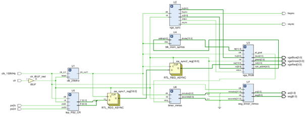

# 🎮 FPGA Maze Game – Basys3 (Artix-7)

Dit project implementeert een **2D doolhofspel** op een **Basys3 FPGA board** met **VGA-uitgang** en **PS/2 toetsenbord**.  
De speler bestuurt een avatar door het doolhof met de ZQSD-toetsen en moet het eindpunt bereiken.  
De speeltijd wordt bijgehouden en weergegeven op de **7-segment displays**.

---

## 📋 Features
- VGA-output **640×480 @ 60 Hz** (25 MHz pixelclock).  
- Hardgecodeerd doolhof in **vga_RGB**.  
- Besturing via **PS/2 keyboard** (ZQSD).  
- Collision-detectie met muren.  
- Duidelijk **startpunt (groen)** en **eindpunt (rood)**.  
- Resetfunctie via drukknop.  
- **Timer** zichtbaar op 7-segment display.  
- Optioneel: high-score en pauzefunctie.

---

## 🖼️ Systeemoverzicht
  
*(RTL block design met top-level en submodules)*

---

## 🧩 Modules
- **[`vga_RGB`](https://github.com/kobeNev/fpga_maze_game/blob/main/vga_RGB.vhd)** – Renderer: tekent doolhof en avatar, collision & doel-detectie.  
- **[`vga_sync`](https://github.com/kobeNev/fpga_maze_game/blob/main/vga_sync.vhd)** – VGA-timinggenerator (hsync, vsync, pixel-coördinaten).  
- **[`top_PS2_CR`](https://github.com/kobeNev/fpga_maze_game/blob/main/top_PS2_CR.vhd)** – Keyboardcontroller, wrapper rond:  
  - [`PS2`](https://github.com/kobeNev/fpga_maze_game/blob/main/PS2.vhd) → decodeert toetsenbordscancodes.  
  - [`PS2_CR`](https://github.com/kobeNev/fpga_maze_game/blob/main/PS2_CR.vhd) → vertaalt scancodes naar coördinaten (rij/kolom).  
- **[`blk_mem_sprites`](https://github.com/kobeNev/fpga_maze_game/blob/main/ROM_sprites.coe)** – BRAM met spelerstructuur.  
- **[`timer_mmss`](https://github.com/kobeNev/fpga_maze_game/blob/main/timer_mmss.vhd)** – Timer voor speeltijd (mm:ss).  
- **[`seg_driver_mmss`](https://github.com/kobeNev/fpga_maze_game/blob/main/seg_driver_mmss.vhd)** – 7-segment driver voor weergave tijd.  
- **`clk_25MHz`** – Clock divider van 100 MHz → 25 MHz.

---

## ⚙️ Hardware & Software
- **FPGA**: Xilinx Artix-7 (Basys3 board)  
- **Software**: Vivado 2019.2  
- **Input**: PS/2 toetsenbord  
- **Output**: VGA-monitor + 7-segment displays  

---

## ▶️ Build & Run
1. Clone dit project:  
   ```bash
   git clone https://github.com/<jouw-username>/fpga-maze-game.git
